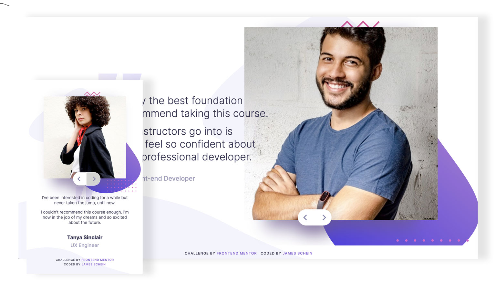

# Frontend Mentor - Coding bootcamp testimonials slider solution

This is a solution to the [Coding bootcamp testimonials slider challenge on Frontend Mentor](https://www.frontendmentor.io/challenges/coding-bootcamp-testimonials-slider-4FNyLA8JL). Frontend Mentor challenges help you improve your coding skills by building realistic projects.

## Table of contents

- [Overview](#overview)
  - [The challenge](#the-challenge)
  - [Screenshot](#screenshot)
  - [Links](#links)
- [My process](#my-process)
  - [Built with](#built-with)
  - [What I learned](#what-i-learned)
  - [Continued development](#continued-development)
  - [Useful resources](#useful-resources)
- [Author](#author)
- [Acknowledgments](#acknowledgments)

## Overview

I have focused on building something scalable that will work for as many candidates as one needs in the carousel. I have increased my experience of data handling and DOM Manipulation to build out a dynamic page when loading. The solution also takes in hammer.js (http://hammerjs.github.io/) for mobile gesture simulation in web apps.

Note - For this challenge I have only prepared two views in respect of media queries/breakpoints - mobile and desktop.

### The challenge

Users should be able to:

- View the optimal layout for the component depending on their device's screen size
- Navigate the slider using either their mouse/trackpad or keyboard

### Screenshot



### Links

- Solution URL: [Testimonials Slider Challenge - Github](https://github.com/jameschein/coding-bootcamp-testimonials-slider-master)
- Live Site URL: [Testimonials Slider Challenge - Live](https://testimonials-slider-challenge.netlify.app/)

## My process

Breaking the task into smaller parts where I felt I could really improve certain skill sets towards more intermediate competence.

- Buildling the UI structure is always a lovely place to start.
- Looking deeper into handling JSON data and the Fetch structure for getting data correctly - I don';t know hy I find this such a struggle but things have improved since I direct focus to that part only through better function chaining in my code.
- DOM Manipulation - another struggle for comfort - was next and I feel I have retrieved a lot of knowledge that gained many years ago but had forgotten.
- Slide carousel next - resource for the method I used listed below.
-

### Built with

- Semantic HTML5 markup
- CSS custom properties
- Flexbox/ CSS Grid
- Mobile-first workflow
- Hammer.js fro mobile gestures
- Fetch and DOM manipulation

### What I learned

Use this section to recap over some of your major learnings while working through this project. Writing these out and providing code samples of areas you want to highlight is a great way to reinforce your own knowledge.

To see how you can add code snippets, see below:

```html
<h1>Some HTML code I'm proud of</h1>
```

```css
.proud-of-this-css {
  color: papayawhip;
}
```

```js
const proudOfThisFunc = () => {
  console.log("🎉")
}
```

### Continued development

API handling and DOM Manipulation - This task really got me looking at youtube frontend interview question videos. These have shown me what I need to do to work faster on-the-fly when presented with a new problem.

More disciplined refactoring sessions for my code are next on the list of things to focus on.

### Useful resources

For the slideshow -

- [Example resource 1](https://www.example.com) - This helped me for XYZ reason. I really liked this pattern and will use it going forward.

For the API/Data handling and DOM Manipulation -

- [Example resource 2](https://www.example.com) - This is an amazing article which helped me finally understand XYZ. I'd recommend it to anyone still learning this concept.

## Author

- Website - [Schein](https://www.schein.co.uk)
- Frontend Mentor - [@jamesschein](https://www.frontendmentor.io/profile/jamesschein)
- Twitter - [@jameschein](https://www.twitter.com/jameschein)

## Acknowledgments

Along with those in the resources above, credit goes to -

- WebDevSimplified
- Chaime
